# Git Good

No professional developer can skimp on properly using a version control systems (VCS). There used to be a plethora of them (CVS, Subversion, Mercurial, etc) but these days `git` is omnipresent and the one we use at SpringTree. The developer world at large relies on the shared workflows being supported by remotes such as GitHub, GitLab, ea. to collaborate and integrate.

Knowing your craft and tools not only includes mastering the basic commands of git but also how to best apply them to an actual project.
This document outlines and provides a (visual) guide for the best practices we use for git at SpringTree.

## Phases

For working with a VCS we outline the following phases:

* developing
* merging
* releasing
* fixing (hot and cold)

Each of these phases has different goals for what you want to get out of your VCS.
Note that not every developer needs to be involved in all these phases. It is not uncommon to have dedicated and different resources for releasing and fixing for instance.

### Branch types and naming

We follow the git-flow naming scheme where we identify the following branch types:

* integration branches
  * `develop`, `main`, `next`
* release branches
  * `release/{major.minor}`
* feature branches
  * `feature/{name or ticket nr}`
* hotfix branches
  * `hotfix/{name or ticket nr}`

These are the only branch name formats that should exists on the remote origin (GitHub in our case).

Local branches (not pushed to github) can be freely named (see developing chapter)

The `next` branch can have different names depending on the customer. Other possible names can be `beta`, `beyond`, etc. Assume those when this documentation refers to `next`.

> [!NOTE]
> Not all repositories have or require 3 integration branches. Libraries projects often only have the `main` branch. Apps with a pilot testing group tend to have a `next` branch in between `main` and `develop`.

#### Integration branches
* should not be committed to directly
* should be protected
* driving force behind our releases.
* perpetually present in the repository

#### Release branches
* prepares a new release from the `develop` integration branch to the next integration branch (either `next` or `main`).
* short lived and are expected to be removed.

#### Feature branches
* add new features and fixes to the `develop` and `release` integration branches.
* short lived and are expected to be removed.

#### Hotfix branches

* apply fixes to integration branches beyond `develop` should be protected.
* Fixes should also be applied to `develop` if they are still applicable.
* short lived and are expected to be removed.
* bypasses the normal release branch flow

### Merge direction

When it comes to merging between integration branches there is only one direction: `develop` -> `release` -> `next` -> `main`
The sections about releasing below will provide (visual) examples of what this looks like.

## Developing

**Goals**:
* never lose your work
* experiment and be creative
* solve a bug or build the feature

**Git command used**:
* git branch
* git commit
* git push

During development git is part of your toolchain for quickly trying different approaches and steps to solve your coding challenges.
Committing often is recommended to create save points during your development so you can easily go back and forth between different solutions.
All development is done on `feature` branches and these are branched of the `develop` integration branch.
Making local branches off of your `feature` branches to experiment with different approaches costs nothing and highly recommended if the bug or feature is non trivial.
A `feature` branch does not need to be in a compiling state so push your branch to remote once it has a chunk of work in it bigger then you would like to have to write again in the case of the inevitable coffee spil

### Developing new feature
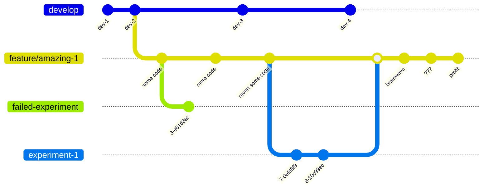

## Merging

**Goals**:
* friction free merge to next integration branch
* make the PR review as easy as possible
* clean and concise commit history
* descriptive commit message for traceability

**Git command used**:
* git squash
* git rebase
* git push (--force)

Now its time to turn in your homework so before presenting it you should cleanup your branch.
You would not turn in a report with pencil marks and post-its everywhere now would you?
The recommended order of operations is: `squash`, `rebase` and then `push --force`.
During development you often go back and forth on your code changes.
Squashing your commits down to just its final result of changes makes for an easier and smaller set of changes to review.
You can reverse the order of squash and rebase but rebasing is the process of replaying your commits from a newer point of your integration branch.
Having only 1 commit also means you have to rebase only 1 commit.
When squashing your commit messages will be combined.
Reviewing and rewriting them for easier consumption by the PR reviewer is recommended instead of just dumping your step notes on them.

### 1. Cleanup experiments
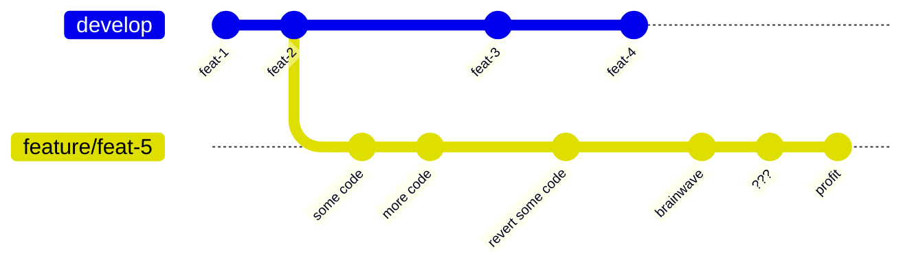

### 2. Cleanup commits (squash)
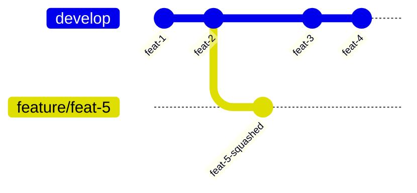

You will need to `git push --force` after squashing to rewrite the timeline to be only one commit.
It makes sense to delay force pushing until you have also rebased (see next step).

> [!IMPORTANT]
> Ensure your commit message accurately reflects the contents of the squashed commits

### 3. Rebase commits and revalidate code changes
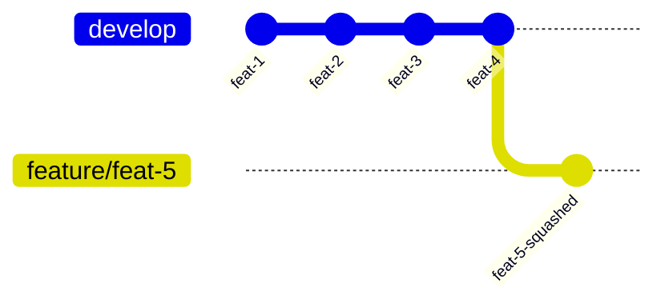

You will need to `git push --force` after rebasing to rewrite the timeline to the new branch position.

> [!TIP]
> Latest changes on develop might influence your new feature. Retest your code and expectations before merging.

### 4. Merge commits after review
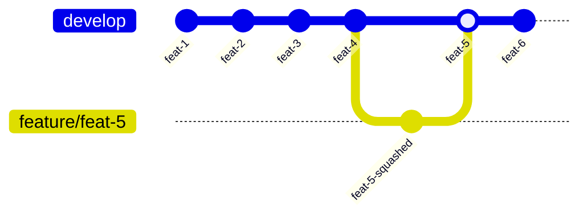

> [!NOTE]
> Force pushing is often frowned upon and dismissed outright. You should indeed **never** force push to an integration branch. But it exists for a reason and that is to cleanup your branche commits **before** merging or working on it with multiple developers. When force pushing to a shared branch inform other developers they need to `git pull --rebase` instead of a normal pull

## Releasing

**Goals**:
* prepare a set of features for release
* create or deploy a testable version from the `release` branch
* fix issues found during testing
* friction free merge to next integration branch
* clean and readable commit history for release changelogs

**Git command used**:
* git branch
* git commit
* git squash
* git push (--force)
* git merge

A `release` branch is made to prepare a new set of features to be prepared to be merged to the next integration branch.
This branch will be used by you Q&A department to test everything before releasing it your customers (or a pilot group).
When following the practices outlined in the merging chapter a release branch should be a neat stack of feature commits that make up the release.
Once we've hit the release stages of working with git the target audience shifts from just developers to Q&A, documentation writers and release managers.
A test version of your application will be made of the `release` branch.
Any issues found will be fixed using the same `feature` branch workflow during development but they are of the `release` branch instead.

### Merging release

When the release has been cleared it should be safe to merge to the next integration branch.
A **rebase** on your target integration branch may be needed if a `hotfix` has occurred (see next chapter for what hot fixes are).
Ideally when looking at all the commits on your integration branches it should provide a clean and human readable timeline of changes within your application.

#### Working on a release
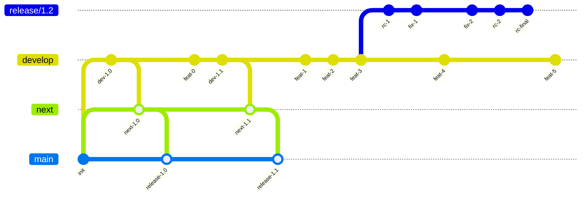

#### Prepare for release (squash)
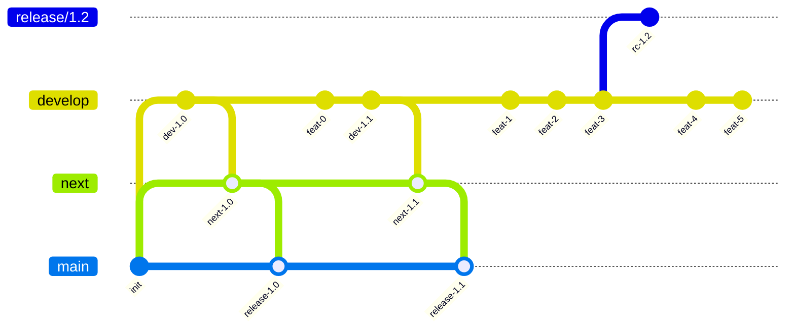

#### Performing a release (merge)
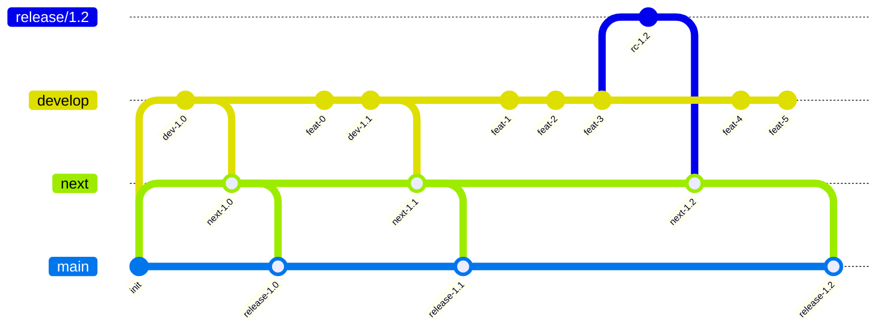

### Post release

Any fixes made on the release branch should also be returned to the `develop` branch.
There are 2 ways to handle this: no commits on `develop` until the release is finished or merge release back to `develop`.
Depending on the complexity and frequency of updates of your codebase merging back to develop might become the most complicated step in your workflow.

#### Post release merge to develop

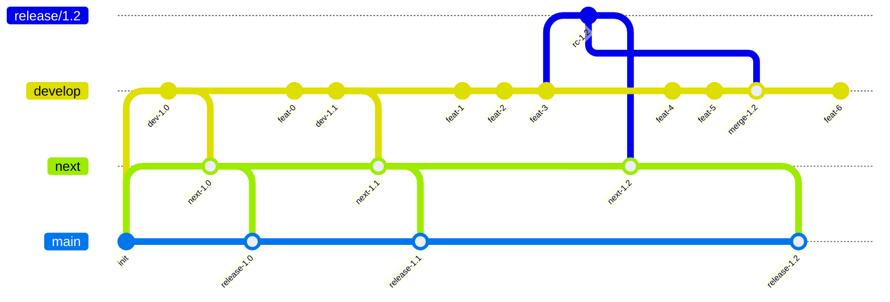

## Fixing

**Goals**:
* isolate and fix the issue
* create or deploy testable version
* merge and release new version
* prevent issue regression
* do not disrupt future releases
* keep the commit timeline readable

**Git command used**:
* git branch
* git commit
* git cherry-pick
* git squash
* git push (--force)
* git merge

However hard we try issues with our code will be found (hopefully) and they need fixing.
The type of fix depends on where in the release cycle the issues is found.
We differentiate between the following fix types:

* cold fixes
* hot fixes

### Cold fixes

Cold fixing is no different then normal development and occurs when an issue is found on either `development` or a `release/{major.minor}` branch.
Branch naming follows the normal development phase workflow with a `feature` branch.
Any issues found and fixed in a `release` branch will end up back on `develop` using the post release workflow detailed above in the release section.

### Hot fixes

A hot fix is created on the `main` or `next` integration branch directly when an issue is found there.
The hot part is an indication of importance due to the issue existing on live code that is being actively used in production.
The process and workflow for fixing is the same as regular development there is just more pressure on getting it right the first time and out the door as soon as possible.
The workflow for creating a hot fix is:

* create a branch named `hotfix/{name or issue nr}` on the `main` or `next` integration branch
* code your solution according to the development phase workflow
* cleanup and squash your code to prepare for PR review and merging
* rebase in-case of other hot fixes have occurred (bad day at the office)
* create or deploy testable version based on the `hotfix` branch
* merge to `main` or `next` (optionally combined with other hot fixes)
* create and release the new version

### Developing hot fix
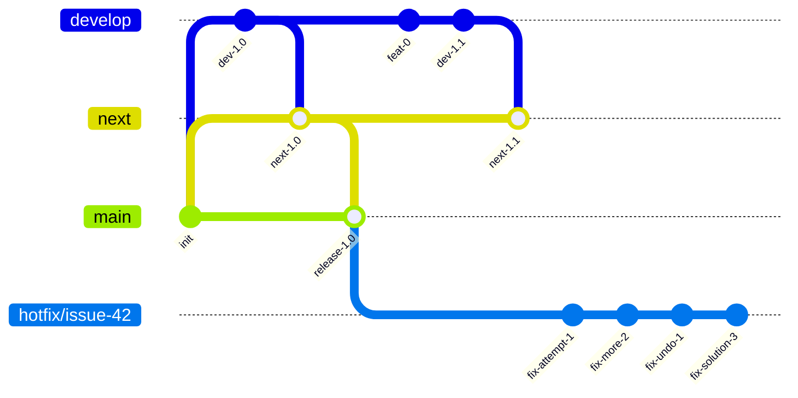

> [!TIP]
> Naming hot fixes after issues is usually the safer bet. Claiming version numbers before merging can bite you if a more important fix comes first and the initial hot fix lingers in testing.

### Cleanup hot fix (squash)
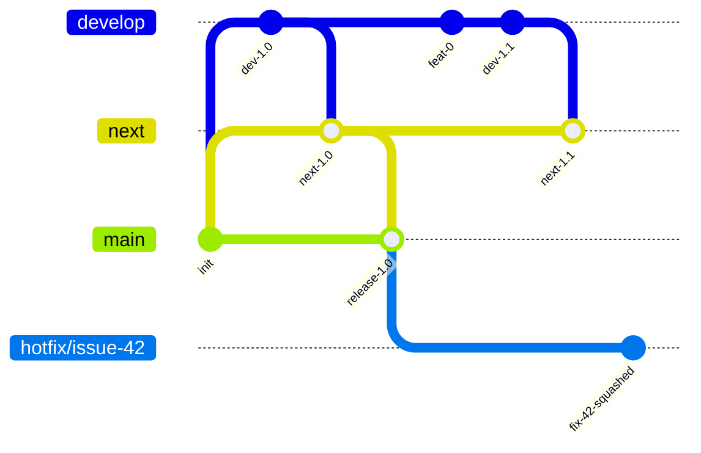

A build from this branch should be tested before merging and releasing to `main`

### Merge hot fix

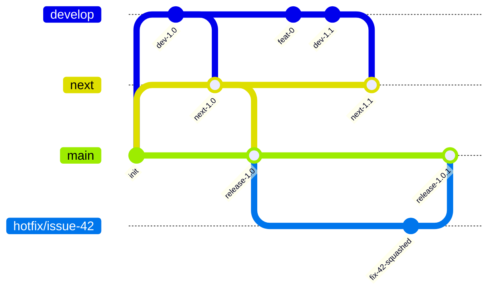

#### Post hot fix merging

Any issues hot fixed on either `main` or `next` needs to also be fixed on the other integration branches.
How and where to fix the same issue depends on the state of the other integration branches.
The issue could be in code that doesn't exist or functions differently on the other integration branches.

> [!IMPORTANT]
> Hot fixes are the most time consuming fixes and require per issue analysis on how to best fix them wherever applicable. There can be no mindless application of the same code on other branches.

If an issue is found and fixed on `next` that also exists in the code on `main` a decision needs to be made if it can wait for the next release cycle.
If it cannot wait until the next release another `hotfix` workflow will need to be done on the `main` branch going through all the same motions.
If the issue exists in code that also exists on `develop` a cold fix workflow should be followed to also fix the issue there.

Depending on how many changes there are in the code that needs to be updated for the fix we can use the `git cherry-pick` command to apply the same changes of the main `hotfix` branch.
Merging or rebasing integration branches directly with each other will obfuscate the timeline and commits.
It also risks regressions of other issues which might be missed in the melee of merge commits especially for larger issues.

### Hot fix next and develop (cherry pick)
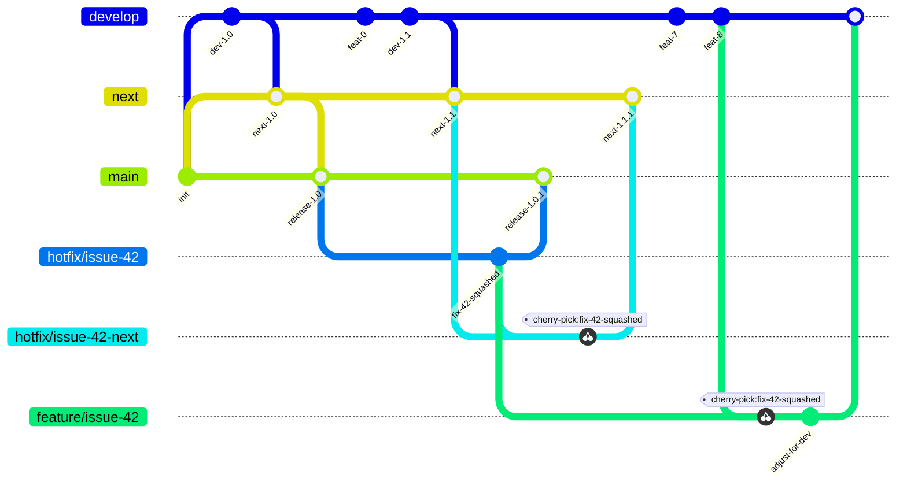

As you can tell from the timelines hot fixing can quickly obfuscate your previously linear timelines.
Obviously hot fixes should be prevented at all cost but they are an inevitability.
As an alternative to cherry picking you can also consider creating fresh branches for each integration branch.
Also note that cherry picking might not always work depending on the hot fix commit and the state of the receiving integration branch.

### Hot fix next and develop (unique commits)
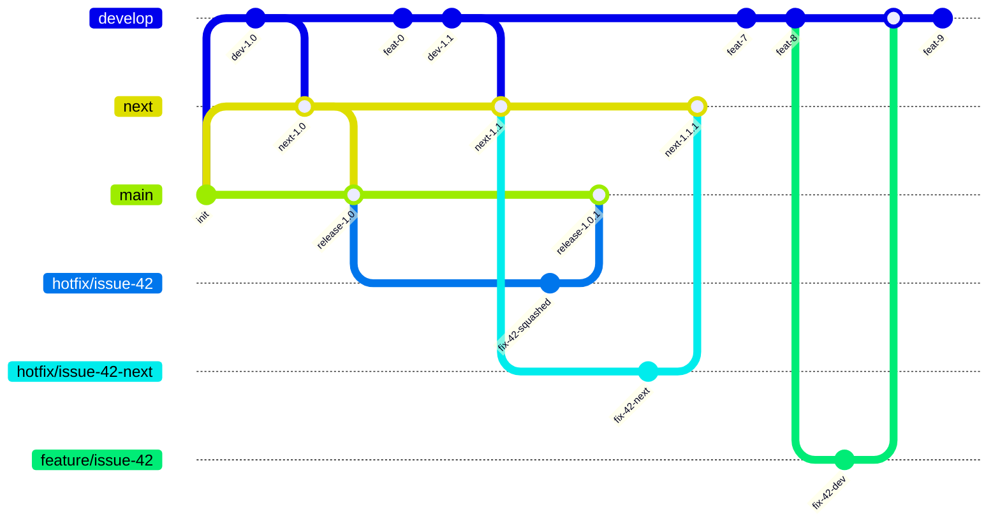

## Wrapping up

When following the above steps building and fixing your code won't become any easier.
However working with your code, combining it with others code and ensuring it is released correctly should.
Finding out exactly when and where a piece code entered your codebase should be easier to deduce from your SVC timelines.
Tracking releases and the dreaded hot fixes will complicate your life but in the long term by following the approach outlined in this document it should become easier to keep an overview.

Happy coding!
