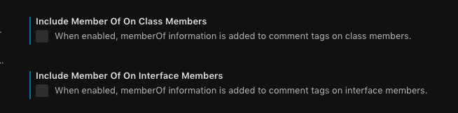

# SpringTree coding guidelines

[](https://badge.fury.io/js/%40springtree%2Fcoding)

This repository contains information about our company rules and guidelines when it comes to writing software.
Our primary development language is JavaScript/TypeScript so those will be featured here prominently.
A collection of configuration files for various tools and linters that can be used in our projects can also be found here.

You can now use `npx` to setup linting and the gitcommit hooks using this repository:

```bash
npx @springtree/coding --init
```

If you are using a project without TypeScript run:

```bash
npx @springtree/coding --init --skip-ts
```

## Style guide

We have adopted the [Airbnb](https://github.com/airbnb/javascript) style guide for our JavaScript and TypeScript projects.
This is a very widely used standard and support is available in a multitude of editors and CI tools.
We have only modified the following rules:

* max line length increased to 160
* allow console statements

All new projects must use this style guide.
When coding on an existing project stick to the current style used throughout that project if there are too many issues when switching.
This repository contains configuration files for [eslint](linters/.eslintrc) and [tslint](linters/.tslint.json).

You can install these tools using npm:

```bash
npm i -D eslint eslint-config-airbnb eslint-plugin-jsx-a11y eslint-plugin-react eslint-plugin-import tslint tslint-config-airbnb
```

### Code comments

Try to document why your code is there not what it does.
Document any special circumstances you've encountered when writing or adjusting said code.
Well structured and documented code will save you and your co-workers time in the future.
Writing out your code comments before writing any actual code is also a nice trick to organise your thoughts before diving into the details.

Feel free to to read [this article](https://medium.freecodecamp.org/code-comments-the-good-the-bad-and-the-ugly-be9cc65fbf83) as a nice primer.

For your VSCode you can install the [document this plugin](https://marketplace.visualstudio.com/itemdetails?itemName=joelday.docthis) to help with the automatic generation of JSDoc style comments for your code.
Please disable the memberOf generation in your vscode preferences for this plugin.


## Human language

All code, variable names, code comments and documentation should be written in English.

## Project README

Every project needs to have a `README.md` (or equivalent) that must contain:

* the name and purpose of the project
* how to run the project
* how to build the project

Any additional information about how to run unit tests should be added if available.

## Git flow AVH

We use [Git flow AVH](https://github.com/petervanderdoes/gitflow-avh) as our branching strategy.
You can install this on a Mac using [Homebrew](https://brew.sh/)

```bash
brew install git-flow-avh
```

We have a whole wiki page dedicated to [how we use Git flow to perform releases](https://github.com/SpringTree/coding-guidelines/wiki/Release-&-development-flow).
Try to contain work in separate feature branches as much as possible.

## Git branch protection and enforcement

Projects on GitHub should be set up with branch protection to now allow direct pushes to the `master` and `develop` branches.
The restriction on `master` is also enforced for administrators.
We have our own [git branch name checking tool](https://github.com/SpringTree/check-git-branch-name).

Branch naming checking can be installed with:

```bash
npx @springtree/coding --gitflow
```

NOTE: Be sure to initialize your repo with git-flow first and perform the initial push of master and develop branches.

## Git commit log format

We use the Angular commit log format which we enforce using a combination of [commitlint](https://github.com/marionebl/commitlint) and [husky](https://github.com/typicode/husky).

You can install these tools using npm:

```bash
npm i -D husky @commitlint/cli @commitlint/config-angular
```

Add the following husky hook to your package.json to enforce the format:

```json
  "husky": {
    "hooks": {
      "commit-msg": "commitlint -E HUSKY_GIT_PARAMS"
    }
  },
```

Create a commitlint configuration files:

```bash
echo "module.exports = { extends: ['@commitlint/config-angular'] }" > commitlint.config.js
```

## Build using CI

All projects should be built using a CI and should not depend on the build chain of an individual developers laptop.
This should preferably be set up at project inception.

We use the following CI's at this time:

* [Bitrise.io](http://bitrise.io) (for mobile)
* [TravisCI](https://travis-ci.com) (general purpose)
* CloudBuild (Google projects)

Use tools like docker to encapsulate your build chain.

### Pull request validation with CI

Pull requests should be set up to use the CI to validate the branch is building.
If available this should include running the unit test suite.
